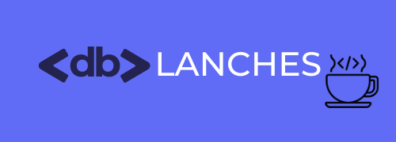
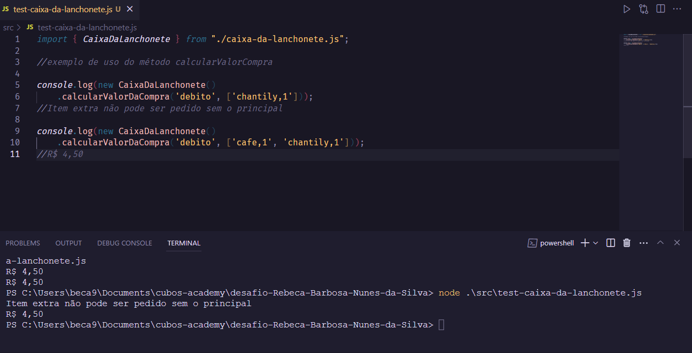

## Descrição do Projeto

Repositório criado para apresentar uma solução para o desafio do programa de estágio da DB Start.

O caixa da lanchonte da DB precisava ser automatizado e para isso era necessário calcular o valor do pedido de um cliente de acordo com o cardápio, regras e descontos da Lanchonete.

Para resolver, implementei um método que calcula o valor de um pedido, utilizando as tecnologias javascript e Node.js.

### Regras de Negócio:

- Pagamento em dinheiro tem 5% de desconto;
- Pagamento a crédito tem acréscimo de 3% no valor total;
- Caso item extra seja informado num pedido que não tenha o respectivo item principal, apresentar mensagem "Item extra não pode ser pedido sem o principal".
- Combos não são considerados como item principal.
- É possível pedir mais de um item extra sem precisar de mais de um principal.
- Se não forem pedidos itens, apresentar mensagem "Não há itens no carrinho de compra!"
- Se a quantidade de itens for zero, apresentar mensagem "Quantidade inválida!".
- Se o código do item não existir, apresentar mensagem "Item inválido!"
  Se a forma de pagamento não existir, apresentar mensagem "Forma de pagamento inválida!"

## Funcionalidades 🧰

- _Calcular Valor da Compra_
  Método que calcula o valor de uma compra de acordo com a forma de pagamento (dinhero, débito ou crédito), os itens do pedido e retorna esse valor em formato de texto.



## Como Rodar o Projeto:

- [ ] Ter o [Node.js](https://nodejs.org/pt-br/download) instalado;
- [ ] Clonar este repositório utilizando o comando:

```
git clone https://github.com/RebecaBNunes/desafio-Rebeca-Barbosa-Nunes-da-Silva.git
```

- [ ] Navegar até a pasta do projeto e executar o arquivo 'test-caixa-da-lanchonete.js' através do Node.js:

```javascript
node .\src\test-caixa-da-lanchonete.js
```

_Observação_:

É possível, também, executar os testes de caso da DB e para isso será necessário instalar a dependência Jest e, em seguida, rodar o script de teste:

```javascript
npm install // instala dependências do projeto
```

```javascript
npm run test // executa o script de testes
```


## Ferramentas Utilizadas:

<div>
  
  
  
           
</div>
